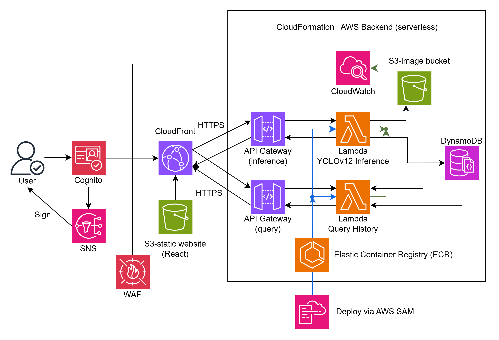

# YOLOv12 Cloud Computing Project

Welcome to the YOLOv12 Cloud Computing Project! This repository contains the codebase and infrastructure required to deploy YOLOv12 object detection models in a **fully serverless AWS environment**. The system supports real-time image uploads, model inference, result visualization, and historical query functionality.

- Project website: <https://dv0l1l3woumqj.cloudfront.net>
- YouTube demo: <https://youtu.be/example>

This is the final project for CS 2060 at University of Pittsburgh, Fall 2025.


## Project overview

The project consists of three main components:

- `Web Interface`: A React-based web application that provides a user-friendly interface for uploading images, viewing inference results, and querying past runs. It uses AWS Cognito for user authentication.
- `Inference API`: A serverless API built with AWS Lambda and API Gateway that accepts image uploads, runs YOLOv12 inference, and stores results in DynamoDB.
- `Query API`: A serverless API that allows users to query their past inference runs and retrieve results.

### Inference workflow

This API is the main entry point for users to upload images and run YOLOv12 inference. The workflow is as follows:

1. User uploads an image via a **POST** request to the `/inference` endpoint, along with their user identifier and model choice.
2. The Lambda function processes the image using the selected YOLOv12 model (small, medium, or large) running in a containerized environment.
3. Detected objects and metadata (e.g., inference time, model used) are stored in DynamoDB tables.
4. The original image is saved to an S3 bucket for future reference.
5. The API returns the detection results to the user.

### Query workflow

This API allows users to query their past inference runs. The workflow is as follows:

1. User sends a **POST** request to the `/query` endpoint with their user identifier.
2. The Lambda function retrieves all inference records associated with the user from DynamoDB.
3. The API returns the list of inference results, including detected objects and links to the original images stored in S3.
4. The user can view their past inference results through the web interface.

## Local development

### Prerequisites

- AWS CLI configured with appropriate permissions
- AWS SAM CLI for local testing and deployment
- Docker installed for building Lambda container images
- Node.js and npm for the web interface
- Python 3.13 for the Lambda functions
- Ultralytics YOLOv12 models and dependencies

### Running locally

Clone the repository:

```bash
git clone https://github.com/jshn9515/yolov12-cloudflow.git
```

#### Web Interface

To deploy the web interface, navigate to the `yolov12-website` directory and run:

```bash
npm install
npm run build
```

Then, upload the `dist/` output to the S3 bucket configured for hosting your CloudFront distribution.

#### Model Conversion (PyTorch → ONNX)

Before deploying the inference API, convert the YOLOv12 PyTorch models to ONNX format by running the conversion script:

```bash
cd yolov12-inference/app/model
pip install -r requirements.txt
python convert.py
```

#### Deploying the Serverless APIs (Inference & Query)

To build and deploy the AWS SAM application, ensure that Docker is installed and running, and that the AWS SAM CLI is properly configured.

Then, navigate to either the `yolov12-inference` or `yolov12-query` directory and run the following commands:

```bash
sam build
sam deploy --guided
```

Deployment parameters are stored in `samconfig.toml` and may be modified as needed.

> [!NOTE]
> If a `sam deploy` attempt fails, you may need to manually delete the previous CloudFormation stack before re-deploying.

> [!WARNING]
> Everytime you create a new API Gateway during deployment, you must update the API endpoint URL in the web dashboard file located at `yolov12-website/src/Dashboard.tsx`. This maybe resolved in the future.

## Technology Stack

|      Domain      |             Technologies Used              |
| :--------------: | :----------------------------------------: |
|      Model       |     YOLOv12 (PyTorch -> ONNX Runtime)      |
|     Frontend     |      React + TailwindCSS + TypeScript      |
|     Backend      | AWS Lambda (Container Image) + API Gateway |
|    CDN & Edge    |             Amazon CloudFront              |
|     Storage      |            Amazon S3 + DynamoDB            |
|    Deployment    |       AWS SAM + ECR + CloudFormation       |
|  Authentication  |            Amazon Cognito + SNS            |
|     Security     |     AWS WAF (Web Application Firewall)     |
|    Monitoring    |             Amazon CloudWatch              |
| Image Processing |               NumPy + Pillow               |

For written justification of technology choices, see [justification.md](justification.md).

## Architecture Diagram



## Difficulties Encountered

- The CloudFront distribution expects static assets in S3 and returns a 403 for unknown paths. Because React Router handles routing on the client, we configured a custom error response to redirect 403 to index.html, enabling proper SPA navigation.
- Packaging YOLOv12 PyTorch models resulted in container images close to 10 GB, exceeding Lambda’s constraints. To overcome this, we converted the models to `ONNX` format and used `ONNX Runtime` for inference, significantly reducing the image size.
- Maunually configuring AWS resources through the Management Console is error-prone and time-consuming. We adopted AWS SAM to define and manage our infrastructure as code, enabling consistent and repeatable deployments.

## Known Issues

- Cold start latency for large Lambda container images may cause timeouts, especially for YOLOv12-medium and YOLOv12-large.
- CloudFront rejects `multipart/form-data` requests under certain configurations; API Gateway works when accessed directly.
- The "Sign out" button in the web interface is not functioning correctly and requires further debugging.
